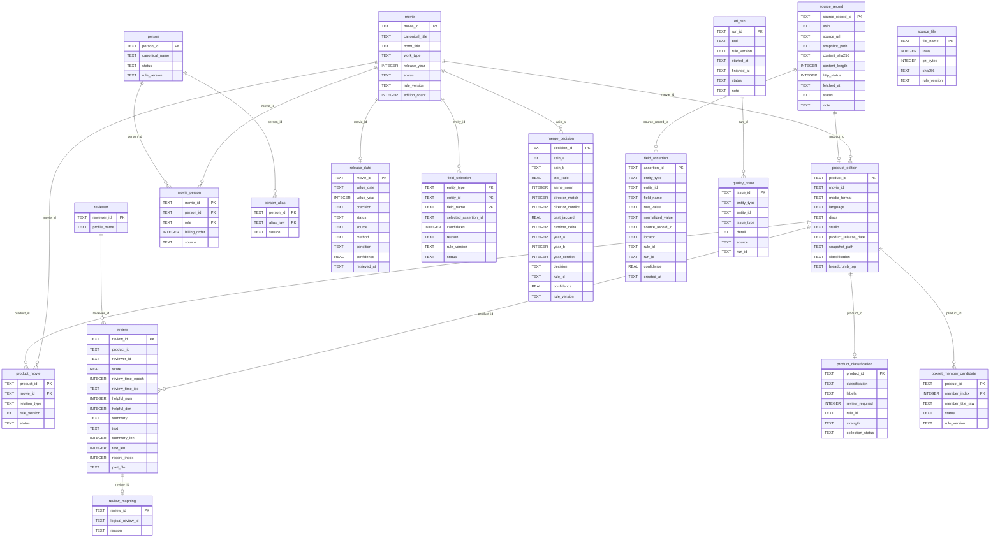

# 目标层 ER 图（自动生成）

> 由 crawler/gen_schema_docs.py 依据 data/target/target.db 生成；
> Mermaid 语法，GitHub / VSCode 可直接渲染。

```mermaid
erDiagram
    movie ||--o{ product_edition : "movie_id"
    movie ||--o{ product_movie : "movie_id"
    product_edition ||--o{ product_movie : "product_id"
    product_edition ||--o{ review : "product_id"
    reviewer ||--o{ review : "reviewer_id"
    review ||--o| review_mapping : "review_id"
    movie ||--o{ movie_person : "movie_id"
    person ||--o{ movie_person : "person_id"
    person ||--o{ person_alias : "person_id"
    product_edition ||--o| product_classification : "product_id"
    source_record ||--o| product_edition : "product_id"
    movie ||--o| release_date : "movie_id"
    movie ||--o{ field_selection : "entity_id"
    movie ||--o{ merge_decision : "asin_a"
    source_record ||--o{ field_assertion : "source_record_id"
    etl_run ||--o{ quality_issue : "run_id"
    product_edition ||--o{ boxset_member_candidate : "product_id"
    boxset_member_candidate {
        TEXT product_id PK
        INTEGER member_index PK
        TEXT member_title_raw
        TEXT status
        TEXT rule_version
    }
    etl_run {
        TEXT run_id PK
        TEXT tool
        TEXT rule_version
        TEXT started_at
        TEXT finished_at
        TEXT status
        TEXT note
    }
    field_assertion {
        TEXT assertion_id PK
        TEXT entity_type
        TEXT entity_id
        TEXT field_name
        TEXT raw_value
        TEXT normalized_value
        TEXT source_record_id
        TEXT locator
        TEXT rule_id
        TEXT run_id
        REAL confidence
        TEXT created_at
    }
    field_selection {
        TEXT entity_type PK
        TEXT entity_id PK
        TEXT field_name PK
        TEXT selected_assertion_id
        INTEGER candidates
        TEXT reason
        TEXT rule_version
        TEXT status
    }
    merge_decision {
        TEXT decision_id PK
        TEXT asin_a
        TEXT asin_b
        REAL title_ratio
        INTEGER same_norm
        INTEGER director_match
        INTEGER director_conflict
        REAL cast_jaccard
        INTEGER runtime_delta
        INTEGER year_a
        INTEGER year_b
        INTEGER year_conflict
        TEXT decision
        TEXT rule_id
        REAL confidence
        TEXT rule_version
    }
    movie {
        TEXT movie_id PK
        TEXT canonical_title
        TEXT norm_title
        TEXT work_type
        INTEGER release_year
        TEXT status
        TEXT rule_version
        INTEGER edition_count
    }
    movie_person {
        TEXT movie_id PK
        TEXT person_id PK
        TEXT role PK
        INTEGER billing_order
        TEXT source
    }
    person {
        TEXT person_id PK
        TEXT canonical_name
        TEXT status
        TEXT rule_version
    }
    person_alias {
        TEXT person_id PK
        TEXT alias_raw PK
        TEXT source
    }
    product_classification {
        TEXT product_id PK
        TEXT classification
        TEXT labels
        INTEGER review_required
        TEXT rule_id
        TEXT strength
        TEXT collection_status
    }
    product_edition {
        TEXT product_id PK
        TEXT movie_id
        TEXT media_format
        TEXT language
        TEXT discs
        TEXT studio
        TEXT product_release_date
        TEXT snapshot_path
        TEXT classification
        TEXT breadcrumb_top
    }
    product_movie {
        TEXT product_id PK
        TEXT movie_id PK
        TEXT relation_type
        TEXT rule_version
        TEXT status
    }
    quality_issue {
        TEXT issue_id PK
        TEXT entity_type
        TEXT entity_id
        TEXT issue_type
        TEXT detail
        TEXT source
        TEXT run_id
    }
    release_date {
        TEXT movie_id PK
        TEXT value_date
        INTEGER value_year
        TEXT precision
        TEXT status
        TEXT source
        TEXT method
        TEXT condition
        REAL confidence
        TEXT retrieved_at
    }
    review {
        TEXT review_id PK
        TEXT product_id
        TEXT reviewer_id
        REAL score
        INTEGER review_time_epoch
        TEXT review_time_iso
        INTEGER helpful_num
        INTEGER helpful_den
        TEXT summary
        TEXT text
        INTEGER summary_len
        INTEGER text_len
        INTEGER record_index
        TEXT part_file
    }
    review_mapping {
        TEXT review_id PK
        TEXT logical_review_id
        TEXT reason
    }
    reviewer {
        TEXT reviewer_id PK
        TEXT profile_name
    }
    source_file {
        TEXT file_name PK
        INTEGER rows
        INTEGER gz_bytes
        TEXT sha256
        TEXT rule_version
    }
    source_record {
        TEXT source_record_id PK
        TEXT asin
        TEXT source_url
        TEXT snapshot_path
        TEXT content_sha256
        INTEGER content_length
        INTEGER http_status
        TEXT fetched_at
        TEXT status
        TEXT note
    }
```
